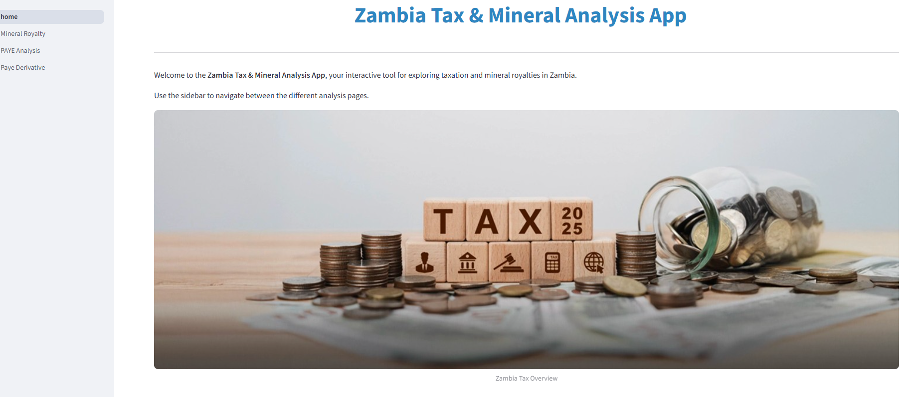

# Zambia Tax & Mineral Analysis App


An interactive Streamlit app for analyzing **Zambia's PAYE tax system** and **mineral royalties**, with visualizations of effective tax rates, marginal points, and copper royalty revenue.

---

## Features

### 1. PAYE Analysis

- Visualize **effective PAYE tax rates** across income levels.  
- Identify **marginal points** where the effective tax rate changes.  
- Explore the **derivative of effective tax rates**.  
- Graphical display with **shaded PAYE bands** for clarity.  
- Full income range from **0 to 2,000,000 ZMW**.

### 2. Mineral Royalty Analysis

- Explore **copper mineral royalty rates** based on official price bands.  
- Compare **stepwise vs smoothed (optimal) royalty rates**.  
- Calculate **revenue based on copper production and price**.  
- Peak revenue marker highlights the **optimal copper price** for maximum revenue.  
- Interactive slider to adjust **copper production**.

---


## Installation

1. Clone this repository:

```bash
git clone <repository_url>
cd zambia-tax-mineral-analysis
